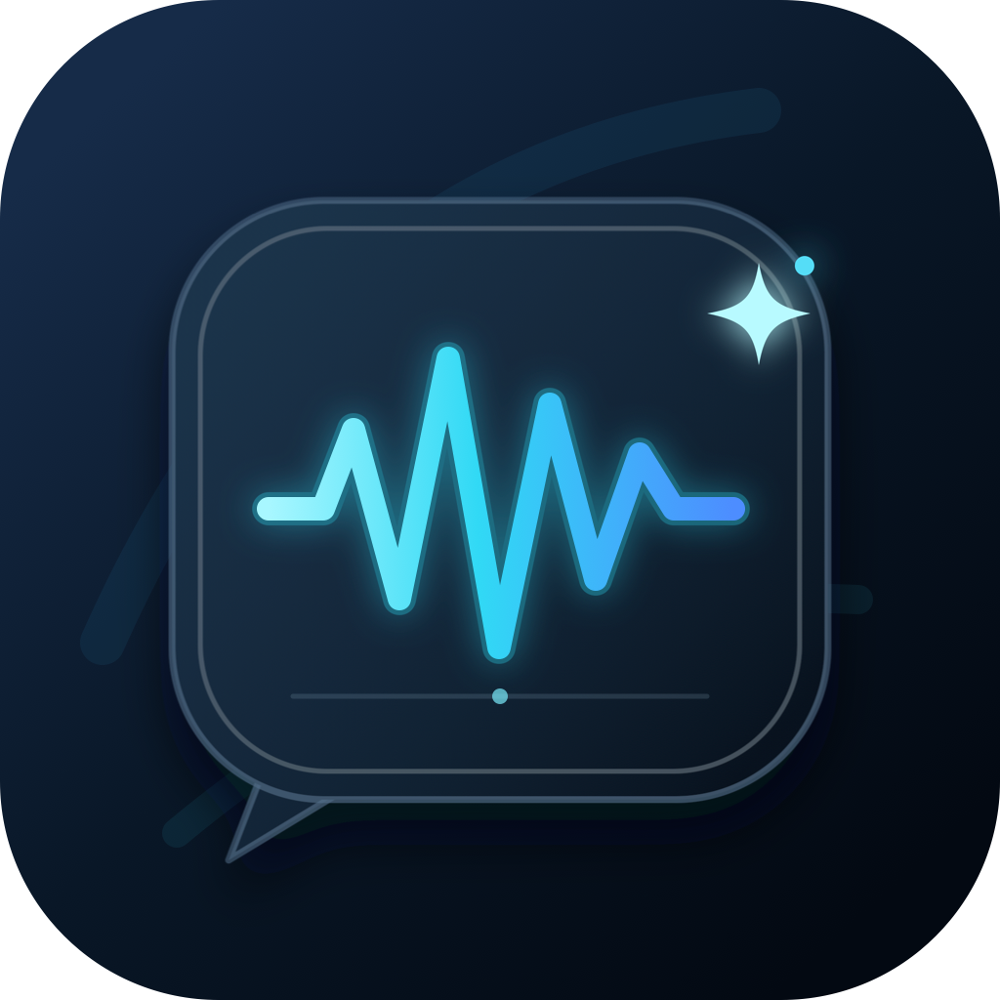

<p align="center">
  
</p>

<h1 align="center">WorkFlow</h1>

<p align="center">
  Choose <kbd>Fn</kbd> or a keyboard shortcut, speak, and keep working.
</p>

WorkFlow is an open-source, macOS-only dictation and meeting-transcription app. Speech recognition stays on your Mac with Parakeet or Whisper. An optional cleanup pass removes fillers, resolves self-corrections, and repairs punctuation through Amazon Bedrock, free local Ollama, or an OpenAI-compatible API.

WorkFlow is independently designed and is not affiliated with Wispr Flow, Superwhisper, or OpenSuperWhisper.

## Use it now

The current v0.5.1 release contains source archives only; a notarized drag-and-drop app is not published yet. Do not bypass Gatekeeper for an unsigned build. The [quickstart](docs/QUICKSTART.md) covers the source install, macOS permissions, the first model download, shortcut selection, and optional Bedrock setup. A coding agent can perform the non-secret setup by following [the agent setup runbook](docs/AGENT_SETUP.md).

```bash
git clone --recurse-submodules https://github.com/picturesuo/WorkFlow.git
cd WorkFlow
brew install cmake libomp rust
./Scripts/install-local.sh
open /Applications/WorkFlow.app
```

Requirements: Apple Silicon, macOS 14 or newer, Xcode, Homebrew, Rust, and Git. On macOS 26 or newer, the local installer requires an Apple-issued signing identity so microphone permission remains functional. See [the quickstart](docs/QUICKSTART.md) if the installer asks you to create one in Xcode.

## Why WorkFlow

- Choose the bottom-left `Fn`/globe key, another modifier, or the permission-free `Option`+backtick shortcut.
- Parakeet v3 runs locally by default; Whisper remains available.
- A single app-wide generation gate prevents a slower, older dictation from pasting over the newest one.
- The recorder starts before accessibility-position lookup, and transcription waits for cold model loading instead of dropping the first request.
- Personal vocabulary and per-app cleanup, style, and paste rules are deterministic.
- Meeting recordings go to named History items and never auto-paste.
- Bedrock, local Ollama, and OpenAI-compatible cleanup all share the same literal-editing safety contract.
- Homework, Technical, and Everyday modes give long-form explanation, compact agent commands, and natural prose separate rewriting contracts.
- History records estimated source/final tokens and Cleanup settings compares each mode's normalized token efficiency.
- Failed, slow, overlong, or assistant-style cleanup falls back to usable local text.
- API credentials live in macOS Keychain; audio never goes to a cleanup provider.
- History shows provider, token usage, and known costs. Bedrock has a default $0.25 monthly estimated-cost stop.
- The interface has explicit VoiceOver labels for its primary controls.

## How dictation works

```text
shortcut down → local recording → Parakeet/Whisper → vocabulary → selected cleanup → targeted paste
                                                       ↘ timeout/error/budget → local text ↗
```

The focused application is captured when recording begins. WorkFlow copies the finished text before paste, restores the previous clipboard only when it is still safe, and grants paste ownership only to the newest dictation.

## Writing modes

Choose a mode in the main window or the WorkFlow menu-bar menu before dictating:

- **Homework** preserves every stated idea and develops compressed reasoning into complete prose. It is intentionally not concise.
- **Technical** produces compact, unambiguous instructions for computers and coding agents while retaining constraints, paths, flags, and acceptance criteria.
- **Everyday** removes speech artifacts while preserving natural tone and detail.

Each successful cleanup stores a local estimate of the source and final text size. History shows the result per dictation, and **Settings → Cleanup** compares Technical with Homework and Everyday for the current month. The comparison uses source tokens ÷ final tokens and a geometric mean across dictations. These are clearly labeled local estimates; provider-reported billing tokens and costs remain separate.

## Cleanup choices

Open **WorkFlow → Settings → Cleanup**, enable cleanup, then select one provider. WorkFlow never silently sends text to a second provider when the selected one fails.

### Amazon Bedrock

The recommended default is Amazon Nova Micro through the `us.amazon.nova-micro-v1:0` inference profile in `us-east-1`.

1. Create a scoped key in the [Amazon Bedrock API keys console](https://console.aws.amazon.com/bedrock/home#/api-keys).
2. In WorkFlow, select **Amazon Bedrock**, paste the key, and choose **Save & Test**.
3. Leave the recommended model, three-second fallback, and $0.25 monthly limit in place unless you have a reason to change them.

Amazon models are available by default in commercial AWS regions when the key has the required Bedrock permissions. If **Save & Test** reports `AccessDeniedException`, confirm the key can invoke Nova Micro in `us-east-1`; an organization policy or restricted account may require an administrator to grant model access.

The key is saved only in macOS Keychain. For production or shared machines, prefer AWS short-term credentials and least-privilege access to the selected model. See AWS's [API key guide](https://docs.aws.amazon.com/bedrock/latest/userguide/api-keys.html) and [Converse API reference](https://docs.aws.amazon.com/bedrock/latest/APIReference/API_runtime_Converse.html).

### Cost estimate

The AWS US on-demand catalog listed Nova Micro at **$0.035 per million input tokens** and **$0.14 per million output tokens** on August 21, 2026. A typical cleanup using 200 input and 40 output tokens is about **$0.0000126**. At 100 such dictations every day, the estimate is about **$0.04/month**.

WorkFlow records returned token counts and displays per-dictation and monthly estimates. Its monthly stop applies to models for which WorkFlow has verified pricing and takes effect after the estimate reaches the configured amount, so one final request can exceed it slightly. Unknown/custom model prices are clearly labeled unknown. Estimates exclude taxes, discounts, free tiers, and future AWS price changes; confirm the [current Bedrock pricing](https://aws.amazon.com/bedrock/pricing/).

### Ollama or another API

- **Ollama:** install [Ollama](https://ollama.com/download/mac), run `ollama pull llama3.2:3b`, then choose **Ollama (local, free)**. No API key or token bill is involved.
- **OpenAI-compatible:** enter an HTTPS base URL, exact model ID, and API key. Localhost HTTP is permitted; remote plaintext HTTP is rejected. Vendor prices vary, so WorkFlow reports tokens but does not invent a dollar estimate.

## Personalization and meetings

Use **Settings → Personalize** for whole-phrase spelling replacements and per-app rules. Rules use the bundle identifier captured at dictation start, so a later focus change cannot redirect the paste. Exports contain vocabulary and rules, never credentials.

Use **Start meeting** for long-form audio. WorkFlow saves a named transcription in History and never pastes meeting text automatically. Remote meeting cleanup is off by default.

## Development

```bash
DEVELOPER_DIR=/Applications/Xcode.app/Contents/Developer \
xcodebuild test \
  -scheme OpenSuperWhisper \
  -derivedDataPath build \
  -destination 'platform=macOS,arch=arm64' \
  -only-testing:OpenSuperWhisperTests \
  CODE_SIGNING_ALLOWED=NO
```

This runs the complete deterministic unit-test target. The separate UI-test target needs an interactive macOS session and is intentionally excluded from headless and agent runs.

The internal Xcode target remains `OpenSuperWhisper` so the fork retains a reviewable history. The app, executable, and bundle identity are WorkFlow. Upgrades copy preferences and History/models forward from earlier Chat or GlowScribe installations without deleting the old data, and securely move provider credentials into WorkFlow's Keychain identity. Because macOS does not migrate privacy grants between bundle identifiers, an existing user must approve Microphone, Accessibility, and—when using a modifier-only shortcut—Input Monitoring once more.

Public binaries require a Developer ID Application certificate and Apple notarization. The release workflow fails closed rather than distributing a build that macOS may reject. See [the maintainer release guide](docs/RELEASING.md).

## Privacy, attribution, and license

- Audio is processed locally.
- Only transcript text reaches the one remote cleanup provider you enable.
- WorkFlow does not write transcript text or provider credentials to diagnostic logs.
- Network failure preserves local text.
- Security reports follow [SECURITY.md](SECURITY.md).

WorkFlow is derived from [Starmel/OpenSuperWhisper](https://github.com/Starmel/OpenSuperWhisper) under the MIT license. The literal-cleanup approach was also informed by [zachlatta/freeflow](https://github.com/zachlatta/freeflow). See [NOTICE](NOTICE) for attribution.

MIT. See [LICENSE](LICENSE).
