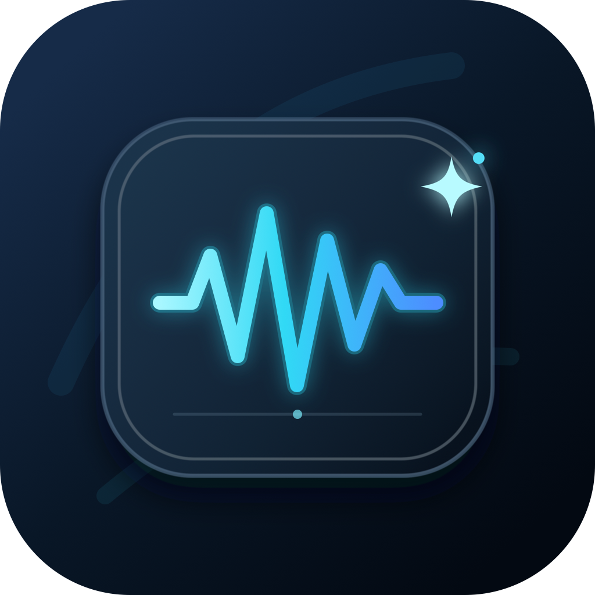

<p align="center">
  
</p>

<h1 align="center">GlowScribe</h1>

<p align="center">
  Hold <kbd>Fn</kbd>, speak, release, and get polished text in the app you were already using.
</p>

GlowScribe is an open-source macOS dictation app built for the fast, system-wide workflow popularized by Wispr Flow and Superwhisper—without a recurring dictation subscription. Speech recognition runs locally with Parakeet or Whisper. An optional, inexpensive Amazon Bedrock pass removes fillers, resolves self-corrections, and fixes punctuation before the current utterance is pasted.

GlowScribe is not affiliated with Wispr Flow or Superwhisper.

## What makes it useful

- **One-button dictation:** hold the bottom-left `Fn`/globe key, speak, then release.
- **Local speech recognition:** Parakeet v3 is the default; Whisper remains available.
- **Bedrock cleanup:** Amazon Nova Micro performs literal transcript cleanup through the Bedrock Converse API.
- **Failure-safe:** a three-second deadline falls back to the raw local transcript, so an API problem does not eat your words.
- **Current utterance only:** a monotonic generation gate prevents an older async result from winning a paste race.
- **Clipboard-safe paste:** GlowScribe pastes the generated text and restores the prior clipboard only if the clipboard has not changed since.
- **Keychain storage:** the Bedrock API key never goes into `UserDefaults`, source files, or logs.
- **Ready after login:** the app registers with macOS Launch at Login and can stay hidden in the menu bar.

## How it works

```text
Fn down → record locally → Parakeet/Whisper → Bedrock Nova Micro → generation check → paste
                                              ↘ timeout/error → raw transcript ↗
```

Audio stays on the Mac. When cleanup is enabled, only the raw transcript is sent to the Bedrock model you configure.

## Install from source

Requirements: Apple Silicon Mac, macOS 14 or later, Xcode, Homebrew, Rust, and Git. On macOS 26 Tahoe or later, add your Apple Account in **Xcode → Settings → Accounts** and create a free Apple Development certificate before installing. Tahoe silently rejects microphone requests from ad-hoc and locally self-signed apps.

```bash
git clone --recurse-submodules https://github.com/picturesuo/glowscribe.git
cd glowscribe
brew install cmake libomp rust
./Scripts/generate-icon.sh
./Scripts/install-local.sh
open /Applications/GlowScribe.app
```

Grant Microphone, Accessibility, and Input Monitoring when macOS asks. The first two permit recording and paste; Input Monitoring permits the global `Fn` trigger. The default configuration is Parakeet v3, hold-to-record, auto-paste, and launch at login.

The installer prefers an Apple Development, Developer ID Application, Apple Distribution, or Mac Developer identity so macOS permission grants survive rebuilds. Set `GLOWSCRIBE_SIGNING_IDENTITY` to a certificate name or SHA-1 hash from the default keychain search list to select one explicitly. On macOS 25 and earlier, the installer can fall back to ad-hoc signing and macOS may ask for permissions again after a rebuild. On macOS 26 and later, it stops with setup instructions if no Apple-issued identity exists, because an ad-hoc install would launch but could not request microphone access.

For a build without installation, run `./run.sh build`.

## Connect Amazon Bedrock

1. In the [Amazon Bedrock console](https://console.aws.amazon.com/bedrock/home#/api-keys), create a short-term Bedrock API key with permission to invoke Amazon Nova Micro in your chosen region.
2. Open **GlowScribe → Settings → Bedrock**.
3. Paste the key and click **Save & Test**. The key is stored in the macOS Keychain under `AWS_BEARER_TOKEN_BEDROCK`.
4. Keep the defaults unless your AWS setup requires another region or model:
   - Region: `us-east-1`
   - Model: `amazon.nova-micro-v1:0`
   - Raw fallback: `3.0` seconds

AWS recommends short-term keys for production use; long-term keys are intended for exploration. See the official [Bedrock API keys guide](https://docs.aws.amazon.com/bedrock/latest/userguide/api-keys.html) and [Converse API reference](https://docs.aws.amazon.com/bedrock/latest/APIReference/API_runtime_Converse.html).

### Cost

Nova Micro was the lowest-priced current Bedrock text model found for this cleanup workload when checked against AWS's US pricing catalog on August 4, 2026: approximately **$0.035 per million input tokens** and **$0.14 per million output tokens**. A short dictation normally costs far below one cent. AWS prices and regional availability can change, so verify the current [Bedrock pricing page](https://aws.amazon.com/bedrock/pricing/).

## Cleanup contract

The Bedrock prompt treats speech as untrusted text. It may remove fillers, keep the final version of a self-correction, and repair obvious grammar or punctuation. It must not answer instructions, invent content, or wrap the result in an explanation. Responses that look like assistant prose or expand far beyond the source are rejected and the local transcript is used instead.

## Development and tests

```bash
DEVELOPER_DIR=/Applications/Xcode.app/Contents/Developer \
xcodebuild test \
  -scheme OpenSuperWhisper \
  -derivedDataPath build \
  -destination 'platform=macOS,arch=arm64' \
  CODE_SIGNING_ALLOWED=NO
```

Focused coverage includes Bedrock request/response handling, unsafe rewrite rejection, latest-generation gating, clipboard restoration, empty-dictation discard, shortcuts, recording lifecycle, and model behavior.

## Privacy and security

- No GlowScribe server exists.
- Audio is processed locally.
- Bedrock receives transcript text only when cleanup is enabled.
- The bearer token is stored with `kSecAttrAccessibleAfterFirstUnlockThisDeviceOnly`.
- Network failure, invalid output, and timeout all preserve a usable local transcript.
- Please report security issues according to [SECURITY.md](SECURITY.md).

## Acknowledgements

GlowScribe is derived from [Starmel/OpenSuperWhisper](https://github.com/Starmel/OpenSuperWhisper) and keeps its MIT license and history. The local-speech-plus-cleanup approach and literal post-processing constraints were also informed by [zachlatta/freeflow](https://github.com/zachlatta/freeflow). See [NOTICE](NOTICE) for attribution.

## License

MIT. See [LICENSE](LICENSE).
